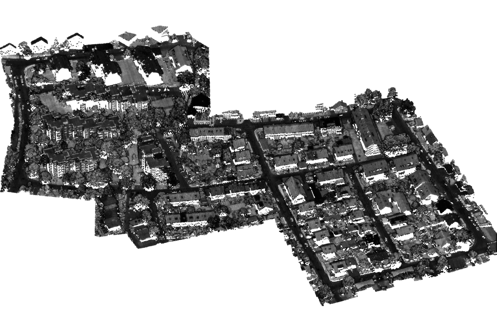
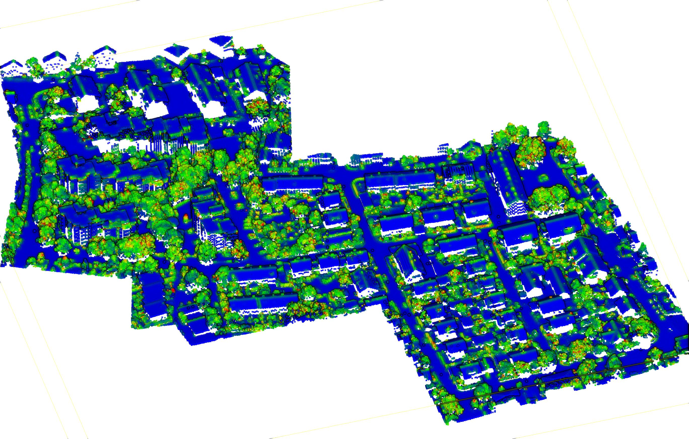
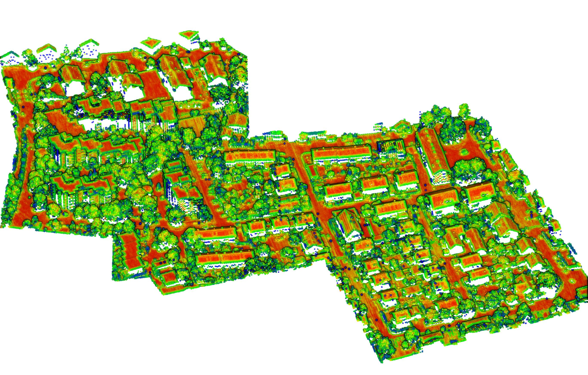
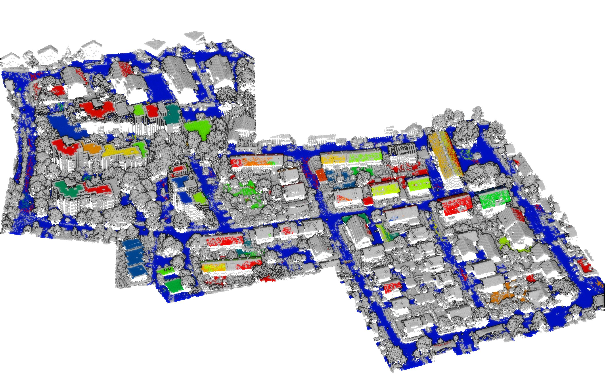
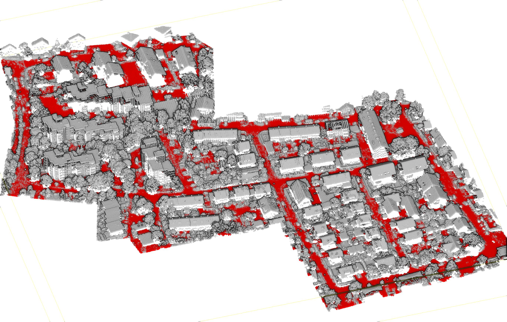
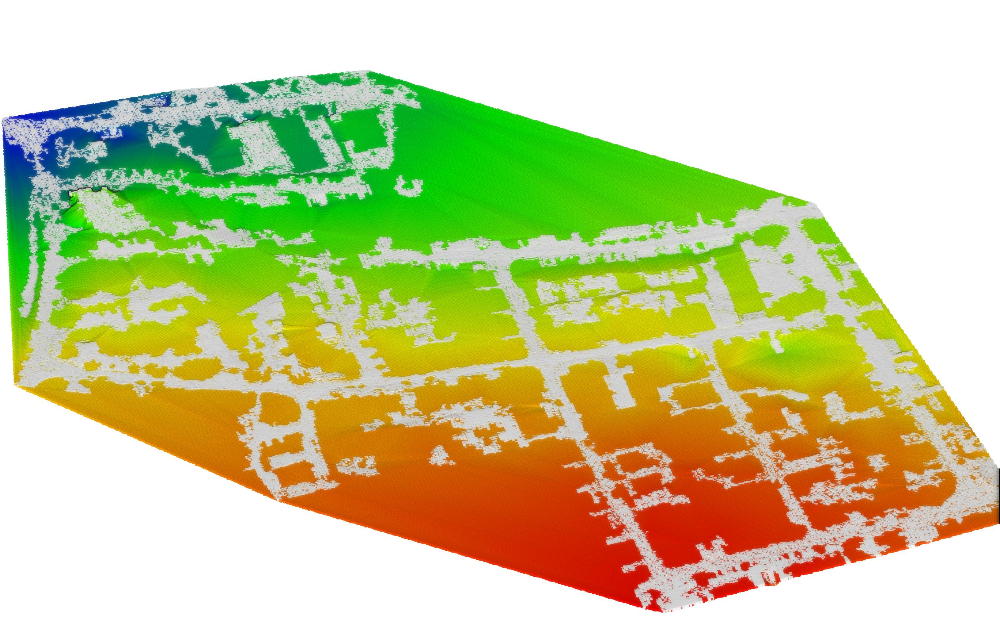
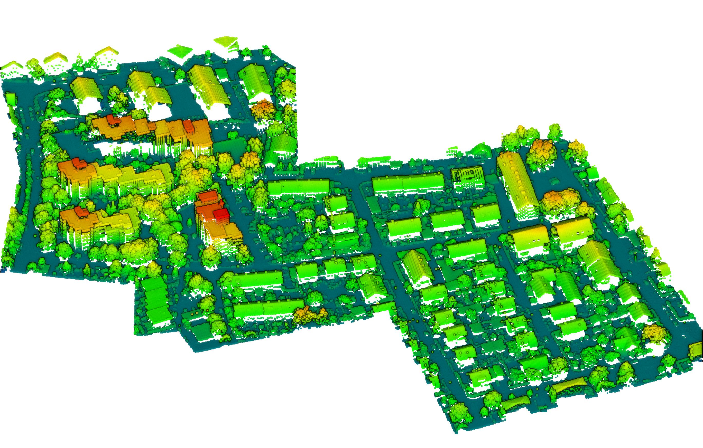
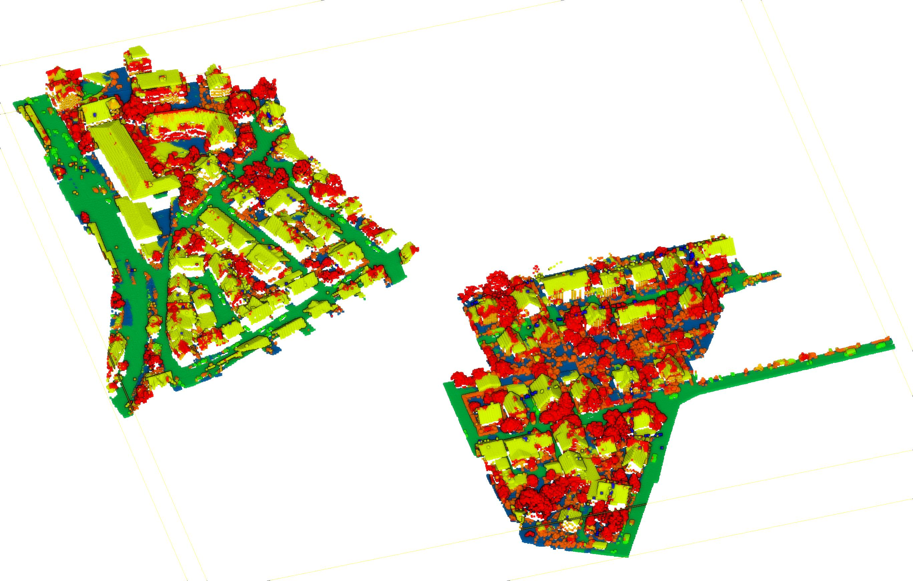

# Aerial point cloud classification
This repository is our project for the course [Point Cloud for 3D Modeling (NPM3D)](http://caor-mines-paristech.fr/fr/cours-npm3d/) of the [IASD master program](https://www.lamsade.dauphine.fr/wp/iasd/en/).
This implementation is strongly inspired from the paper [classification of aerial point clouds with deep learning ](https://www.int-arch-photogramm-remote-sens-spatial-inf-sci.net/XLII-2-W13/103/2019/isprs-archives-XLII-2-W13-103-2019.pdf) by Emre Özdemir and Fabio Remondino.

Our project report is available at the following link : https://www.overleaf.com/read/tdjgnxjbcmpg

## Installation
This project requires python >= 3.5

```
$ git clone https://github.com/theobdt/aerial_pc_classification.git
$ cd aerial_pc_classification
$ pip3 install -r requirements.txt
```


## Getting the data
To get the data, you will first have to request access on the [ISPRS website](http://www2.isprs.org/commissions/comm3/wg4/detection-and-reconstruction.html), it is totally free.
Fill out the questionnaire to receive the credentials.
Then download data using the following script :

```
$ chmod +x fetch_data.sh
$ ./fetch_data.sh
```


## 1. Preprocessing

Convert files to PLY and center/scale the point clouds.
```
$ python3 preprocessing.py -f data/vaihingen3D_train.pts data/vaihingen3D_test.pts --centering
```
Output files will be saved to `data/preprocessed/`.

*Vaihingen training intensity*


## 2. Computing features

Parameters used for features extraction are stored in `cfg/config_features_extraction.yaml`.
Output files will be saved in `data/features/`.

Available steps are : 
1. Local descriptors (`descriptors`). A few examples :
*Normal angles to vertical axis*
*Sphericity*
*Planarity*
2. Region growing (`region_growing`)
*Results of region growing*
3. Ground extraction (`ground_extraction`)
*Ground extraction*
4. Ground rasterization (`ground_rasterization`)
*Ground rasterized*
5. Height above ground (`height_above_ground`)
*Height above ground*

To run all steps at once:
```
$ python3 compute_features.py --full_pipeline --files data/preprocessed/vaihingen3D_train.ply data/preprocessed/vaihingen3D_test.ply 
```

To run all steps starting from a specific one :
```
$ python3 compute_features.py --from_step region_growing --files data/preprocessed/vaihingen3D_train.ply data/preprocessed/vaihingen3D_test.ply
```

To run steps individually :
```
$ python3 compute_features.py --steps region_growing ground_extraction --files data/preprocessed/vaihingen3D_train.ply data/preprocessed/vaihingen3D_test.ply
```


## 3. Training Bi LSTM network

Configuration file for training is stored in `cfg/config_bilstm.yaml`.
To train the network, run the following command :

```
$ python3 train.py
```
A new checkpoint will be created in `ckpts/[current timestamp]`, along with a plot of accuracies and losses throughout training.

## 4. Predict with Bi LSTM network

To compute predictions on all points of the cloud run :
```
$ python3 test.py -f data/features/vaihingen3D_test.ply --ckpt ckpts/2020-04-10_12-25-36
```
A new folder will be created at `data/predictions/[model timestamp]`, along with a comprehensive metrics table.
*9-classes test set*
*9-classes predictions on test set*


*Confusion matrix and metrics*
